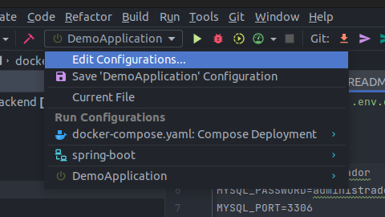
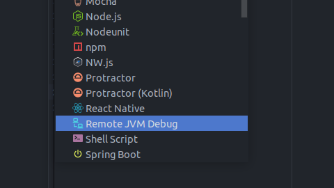
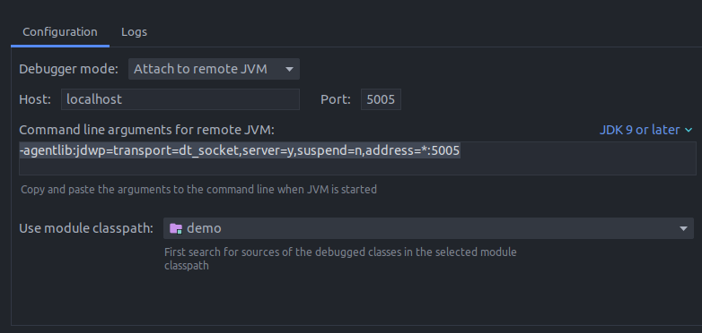

Copiamos el archivo `.env.example` y creamos archivo `.env`. Nos aseguramos de que las variables tengan su valor
correspondiente

Una vez asignado todos los valores a las variables, se puede iniciar con

```shell
docker compose up --build
```

## Configuración Debug
Para utilizar el modo debug, tendremos que copiar el valor de la variable `DEBUG_PORT_ON_DOCKER_HOST`
del archivo **.env** 

Y añadimos una nueva configuración remota de JVM




En `Port` se debe poner el valor asignado a la variable de entorno